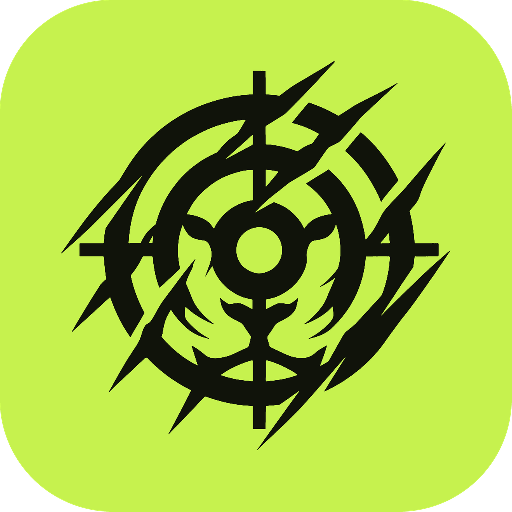

<p align="center"></p>

<h1 align="center">Tigert</h1>
<p align="center"><b>Allenamento e nutrizione, con l'obiettivo nel mirino.</b><br>
App Android + Windows, tutta in italiano, senza account e senza cloud.</p>

---

## Scarica

Dalla pagina [**Releases**](https://github.com/psyko-cyber/tigert/releases/latest):

| Dispositivo | File | Come si installa |
|---|---|---|
| **Android** (7.0+) | `Tigert-x.y.z.apk` | Apri il file sul telefono → consenti "Installa app sconosciute" → Installa |
| **Windows** 10/11 (64 bit) | `Tigert-Setup-x.y.z.exe` | Doppio clic → Avanti → Installa. Se compare "Windows ha protetto il PC": *Ulteriori informazioni* → *Esegui comunque* (l'installer non è firmato) |

Quando esce una nuova versione, Tigert te lo dice da solo.

## Cosa fa

- **Oggi**: voto giornaliero da 0 a 10 (nutrizione 50%, allenamento 35%, abitudini 15%), calorie e macro, acqua, peso, sonno, passi.
- **Nutrizione**: database di oltre 300 alimenti italiani, ricerca e barcode con [Open Food Facts](https://world.openfoodfacts.org), ricette, "solo calorie", copia dei pasti.
- **Foto del piatto con Gemini**: con la tua chiave API (automatico) oppure con il copia-incolla del prompt su gemini.google.com (gratis, senza chiave).
- **Target adattivi**: massa, definizione o mantenimento. Calorie calcolate con Mifflin-St Jeor e corrette ogni 2 settimane con il TDEE reale.
- **Allenamento**: schede pronte (Upper/Lower, PPL, Full body…) ed editor completo, 148 esercizi, timer di recupero, record e 1RM stimato.
- **Coach di progressione**: doppia progressione automatica. Ti dice quando alzare il carico, quando cercare una ripetizione in più, quando scaricare dopo uno stallo e da che peso ripartire dopo una pausa; i carichi nuovi sono già precompilati nella sessione e arrivano anche nella notifica di allenamento.
- **Import da Hevy**: storico, schede e cartelle, esercizi personalizzati e pesate. Con Hevy Pro via chiave API, oppure gratis dal CSV esportato dall'app.
- **Progressi**: grafico del peso con media mobile, foto di confronto, storico esercizi, livelli, streak e 18 badge.
- **Promemoria**: pasti, acqua, allenamento, pesata, riepilogo serale.
- **Sincronizzazione Wi-Fi**: il PC fa da "casa" dei dati, il telefono si abbina con un QR e si sincronizza da solo sulla rete di casa. Nessun server esterno.
- **Windows**: resta nell'area di notifica, si avvia con Windows (opzionale), esporta CSV e backup.

## Sincronizzare telefono e PC

1. Installa Tigert sul PC e completa il profilo.
2. Sul PC: **Profilo → Sincronizzazione Wi-Fi** mostra un QR.
3. Sul telefono: al primo avvio tocca **"Ho già Tigert sul PC"** (oppure Profilo → Sincronizzazione Wi-Fi) e inquadra il QR.

Telefono e PC devono essere sulla stessa rete Wi-Fi e Windows deve considerarla **rete privata**. L'installer apre già la porta nel firewall.

## Importare da Hevy

- **Con Hevy Pro**: su hevy.com → Impostazioni → Developer copia la chiave API, poi in Tigert: Profilo → **Importa da Hevy** → incolla la chiave → *Scarica da Hevy*. Arrivano schede e cartelle, esercizi personalizzati, tutto lo storico e le pesate.
- **Senza Pro**: nell'app Hevy Profilo → Impostazioni → Esporta e importa dati → esporta `workout_data.csv` (e `measurement_data.csv` per le pesate), poi in Tigert *Scegli file CSV*. Le schede vengono ricostruite dagli allenamenti recenti.

Prima di importare vedi l'abbinamento di ogni esercizio Hevy a quello di Tigert e puoi cambiarlo. L'import si può ripetere: gli allenamenti già importati vengono aggiornati, non duplicati.

## Privacy

I dati restano sui tuoi dispositivi. Escono solo:
- le ricerche e i codici a barre verso Open Food Facts;
- le foto che scegli di analizzare, verso Google Gemini (solo con la chiave API);
- il controllo aggiornamenti verso GitHub;
- l'import da Hevy (solo quando lo avvii tu, la chiave non viene salvata).

La chiave API di Gemini resta sul dispositivo e non viene sincronizzata.

> Tigert dà stime e indicazioni generali: non sostituisce il parere di un medico o di un nutrizionista.

---

## Compilare da sorgente

Requisiti: Flutter 3.47+, JDK 17, Android SDK 36 (NDK 28.2), Visual Studio 2022 Build Tools con "Sviluppo di applicazioni desktop con C++", Inno Setup 6. Su Windows serve la **Modalità sviluppatore** (per i symlink dei plugin).

```bash
flutter pub get
flutter test
flutter build apk --release --target-platform android-arm,android-arm64
flutter build windows --release
"%LOCALAPPDATA%\Programs\Inno Setup 6\ISCC.exe" installer\tigert.iss
```

L'APK di release viene firmato con il keystore indicato in `android/key.properties` (non incluso nel repository). Senza quel file la build usa la chiave di debug.

Struttura:

```
lib/core       tema, formattazione, id
lib/data       archivio locale (JSON versionato), modelli, stato dell'app
lib/logic      target, voto, allenamento, traguardi
lib/services   sync Wi-Fi, Gemini, Open Food Facts, notifiche, Windows, aggiornamenti
lib/ui         schermate
installer      script Inno Setup
```

## Crediti

Dati prodotti © Open Food Facts, licenza ODbL · Font Archivo, SIL Open Font License · Stime dalle foto con Google Gemini.
